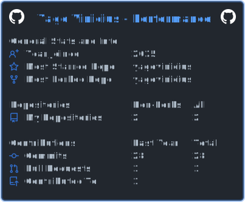

# Olá, sou o Yago | Hi, I'm Yago

<table align="center">
  <tr>
    <td width="50%" valign="top">
      <h3>🇧🇷 Português</h3>
      Arquiteto de Soluções e Analista de Dados no <b>Sebrae GO</b>. Especialista em converter processos complexos em ecossistemas inteligentes com IA e Automação. 
        
      🎓 <i>IA (GRAN) & Adm (Unialfa)</i>
    </td>
    <td width="50%" valign="top">
      <h3>🇺🇸 English</h3>
      Solutions Architect and Data Analyst at <b>Sebrae GO</b>. Expert in converting complex processes into intelligent ecosystems using AI and Automation.
        
      🎓 <i>AI Tech & Business Admin</i>
    </td>
  </tr>
</table>

  
  
  
  

---

### 📊 Estatísticas | Stats

  

---

  
  

